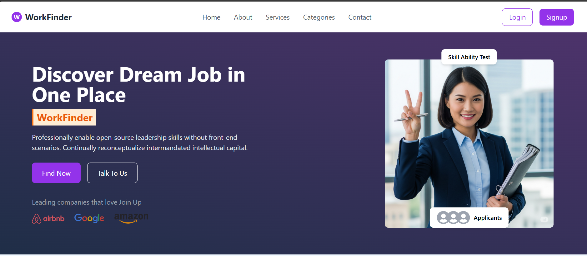
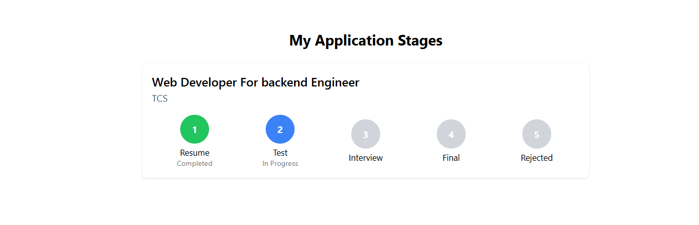
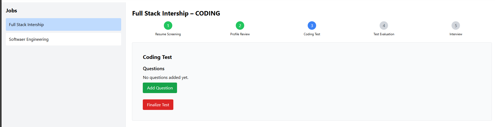

# 🚀 Automated Recruitment System

### AI-Powered End-to-End Hiring Platform

🔗 **GitHub Repository:**
[https://github.com/gauravdev95/Automated-Recruitment-System](https://github.com/gauravdev95/Automated-Recruitment-System)

## 🎥 YouTube Project Walkthrough

<p align="center">
  <a href="https://youtu.be/oFAwrTyHF_4">
    
  </a>
</p>


## 📌 Problem Statement (Why This Project?)

Modern recruitment suffers from **major inefficiencies**:

* Recruiters manually screen **hundreds of resumes**
* Skill mismatch despite good resumes
* No integrated system for **resume + coding test + evaluation**
* Fragmented tools for ATS, coding platforms, and communication

❌ **Manual hiring = time-consuming, biased, and error-prone**

---

## 💡 Solution (What This Project Solves)

The **Automated Recruitment System** is a **full-stack, AI-powered hiring platform** that automates the **entire recruitment lifecycle** in one place:

> From **job posting → resume screening → coding test → shortlisting**

It combines:

* 🤖 **AI Resume Scoring**
* 💻 **Online Coding Assessments**
* 📊 **Automated Candidate Evaluation**
* 🔐 **Secure Role-Based Dashboards**

---

## 🧠 What Makes This Project Special?

<h3>🌟 Key Highlights</h3>

<ul>
  <li>✅ Real-world <b>ATS + Coding Platform</b></li>
  <li>🤖 <b>AI-based semantic resume analysis</b></li>
  <li>🧩 <b>Microservice architecture</b> (ML service separated)</li>
  <li>🔐 <b>Production-style authentication & workflows</b></li>
  <li>📈 Designed for <b>scalability & extensibility</b></li>
</ul>


This is **not just CRUD** — it’s a **system**.

---

## 🧭 High-Level System Architecture

```
Frontend (React)
     |
Backend API (Node + Express)
     |
MongoDB
     |
AI Resume Scoring Service (FastAPI + NLP)
     |
Judge0 API (Coding Test Execution)
```

---

## 🎯 Core Features

### 👨‍🎓 Student Portal

* Profile creation
* Resume upload (PDF)
* Job application
* Online coding tests
* Real-time application status tracking

### 🧑‍💼 HR / Recruiter Portal

* Job posting & management
* AI-based resume screening
* Candidate ranking dashboard
* Coding test evaluation
* Interview shortlisting

---

## 🤖 AI Resume Scoring System (Deep Dive)

A dedicated **FastAPI microservice** performs intelligent resume evaluation.

### 🔍 How It Works

1. PDF resume → text extraction
2. Text cleaning & preprocessing
3. Keyword matching with job description
4. **Semantic similarity using MiniLM (Sentence Transformers)**
5. Weighted final score generation

### 📊 Sample Output

```json
{
  "final_score": 87.45,
  "keyword_score": 82.33,
  "semantic_score": 92.57,
  "missing_keywords": ["react", "mongodb"]
}
```

✔ This reduces bias
✔ Improves matching accuracy
✔ Scales better than manual screening

---

## 💻 Coding Test System

* Integrated **Judge0 API**
* Real-time code execution
* Language-agnostic support
* Automatic evaluation of submissions
* Used as a **second-round filter** after resume screening

---

<h2>🛠️ Technology Stack</h2>

<h3>🎨 Frontend</h3>
<ul>
  <li>⚛️ <b>React.js</b> – Component-based UI</li>
  <li>🎨 <b>Tailwind CSS</b> – Responsive styling</li>
</ul>

<h3>🧠 Backend</h3>
<ul>
  <li>🟢 <b>Node.js</b> – Server runtime</li>
  <li>🚀 <b>Express.js</b> – REST APIs</li>
  <li>🍃 <b>MongoDB</b> – NoSQL database</li>
</ul>

<h3>🤖 AI / ML Microservice</h3>
<ul>
  <li>⚡ <b>FastAPI</b> – High-performance Python API</li>
  <li>📄 <b>pdfplumber</b> – Resume text extraction</li>
  <li>🧠 <b>SentenceTransformers</b> – Semantic similarity</li>
  <li>📊 <b>scikit-learn</b> – Score computation</li>
</ul>

<h3>🔐 Dev & Infra</h3>
<ul>
  <li>🔑 <b>JWT</b> – Authentication</li>
  <li>🔒 <b>Bcrypt</b> – Password security</li>
  <li>📧 <b>Nodemailer</b> – Email service</li>
  <li>💻 <b>Judge0 API</b> – Code execution</li>
</ul>


---

## 🖼️ Screenshots

### 🧑‍🎓 Student Dashboard



### 👩‍💼 HR Dashboard




---

<h2>🧭 End-to-End Project Flow</h2>

<h3>👨‍🎓 Student Journey</h3>

<p>
  📝 <b>Register</b>  
  ➜ 👤 <b>Create Profile</b>  
  ➜ 📄 <b>Upload Resume</b>  
  ➜ 📌 <b>Apply for Job</b>  
  ➜ 💻 <b>Attempt Coding Test</b>  
  ➜ 📊 <b>Track Application Status</b>
</p>

<hr/>

<h3>🧑‍💼 HR / Recruiter Journey</h3>

<p>
  🏢 <b>Create Job Listing</b>  
  ➜ 🤖 <b>AI Resume Screening</b>  
  ➜ 💻 <b>Review Coding Results</b>  
  ➜ 📋 <b>Shortlist Candidates</b>  
  ➜ 🎯 <b>Interview Selection</b>
</p>


---

## ⚙️ Installation & Setup

### Clone Repository

```bash
git clone https://github.com/gauravdev95/Hiring-Platefrom.git
cd hiring-project
```

### Backend

```bash
cd backend
npm install
npm start
```

### Frontend

```bash
cd frontend
npm install
npm start
```

### AI Microservice

```bash
cd ml_api
python app.py
```

---

## 🧗 Challenges Faced (Important for Interviewers)

* Designing **AI scoring logic** that balances keywords + semantics
* Handling **PDF parsing inconsistencies**
* Microservice communication between Node & FastAPI
* Securing role-based access (Student vs HR)
* Integrating third-party Judge0 reliably

✅ Solved using modular design & clean APIs

---

## 🚀 Future Enhancements

* Video Interview Module
* Real-time Notifications (Socket.IO)
* Advanced NLP (BERT / SBERT)
* HR Analytics Dashboard
* Bulk Email & SMS Automation

---

## 👨‍💻 Author

**Gaurav Yadav**
📧 Email: [gauravyadavgh@example.com](mailto:gauravyadavgh@example.com)
🔗 LinkedIn: [https://www.linkedin.com/in/gauravyadav95/](https://www.linkedin.com/in/gauravyadav95/)
🐙 GitHub: [https://github.com/gauravdev95](https://github.com/gauravdev95)

---

## ⭐ Final Note

> This project reflects my ability to build **real-world, scalable, AI-powered systems** using modern full-stack technologies.

If you like this project, ⭐ the repo — it motivates me to build more 🚀

---

